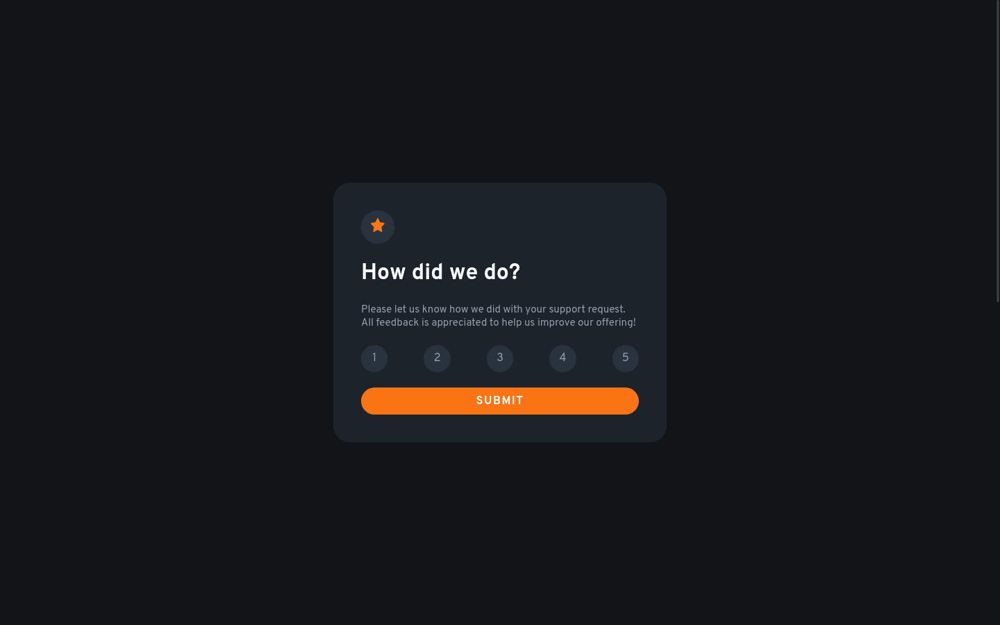
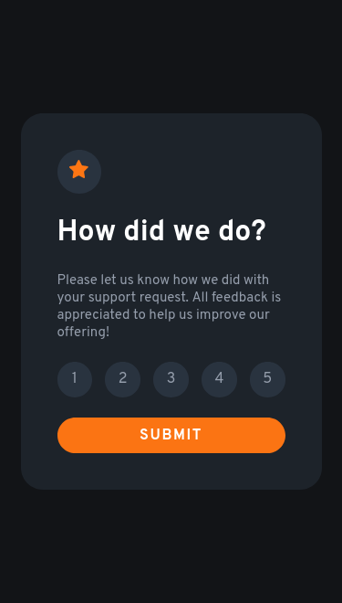

# Frontend Mentor - Interactice-rating component

## Welcome! 👋

### The challenge

Your users should be able to:

-View the optimal layout for the page depending on their device's screen size

### Screenshot

### Links

- Solution URL: [Solution](https://www.frontendmentor.io/solutions/made-with-vanila-html-and-css-flexbox-and-media-quaries-7aVaa-FkjT)
- Live Site URL: [Live site](https://muazzy.github.io/clipboard-landing-page/)

### Built with

- Semantic HTML5 markup
- Bootstrap 4
- CSS Flexbox